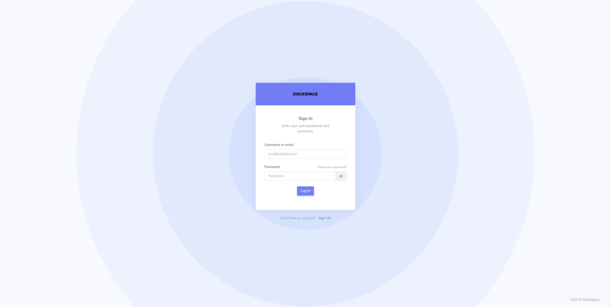
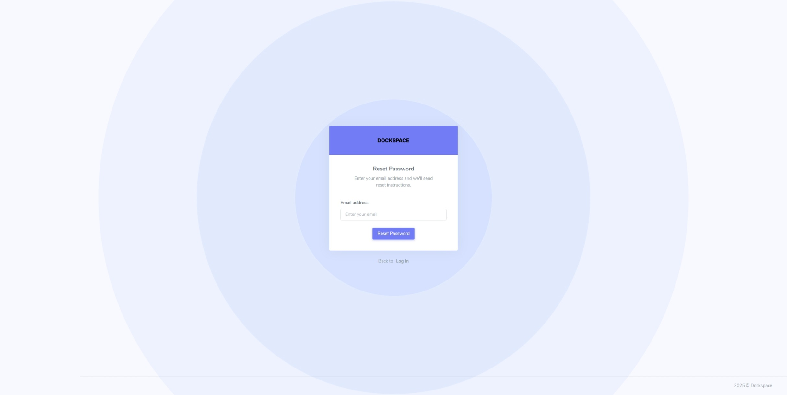
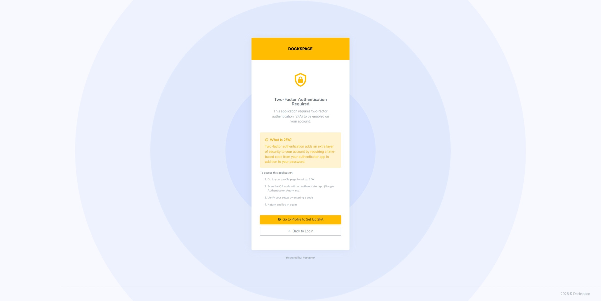
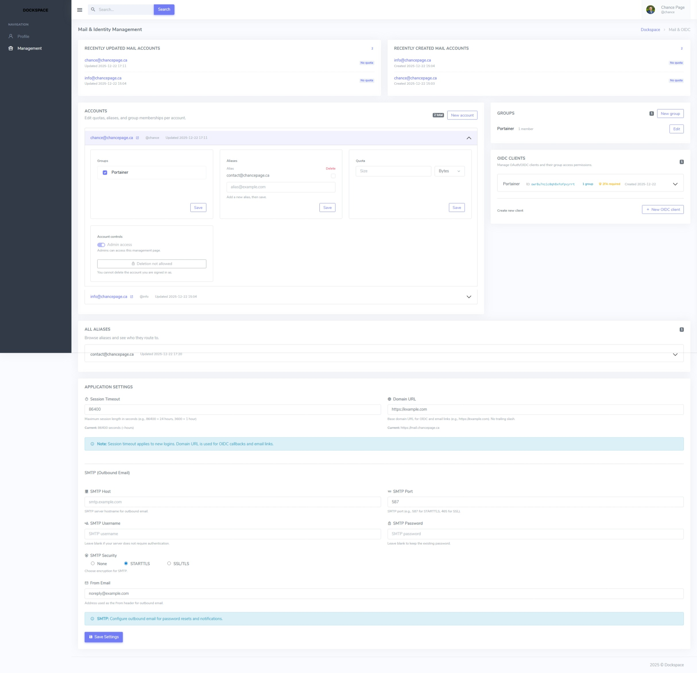
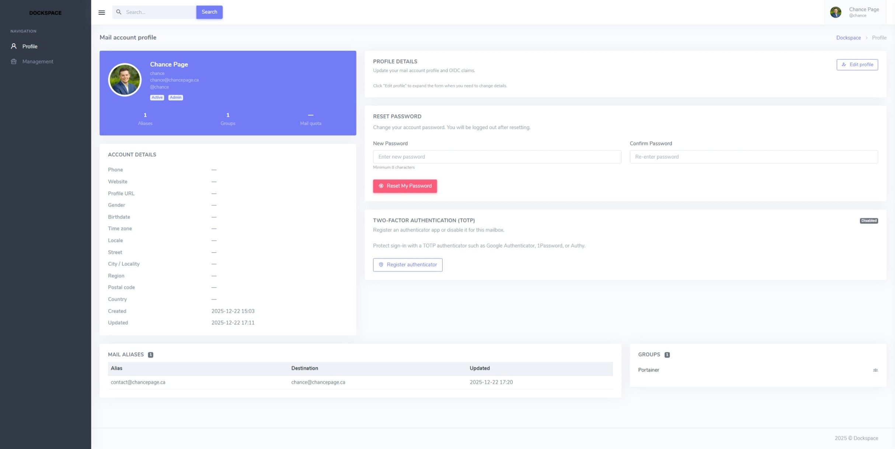
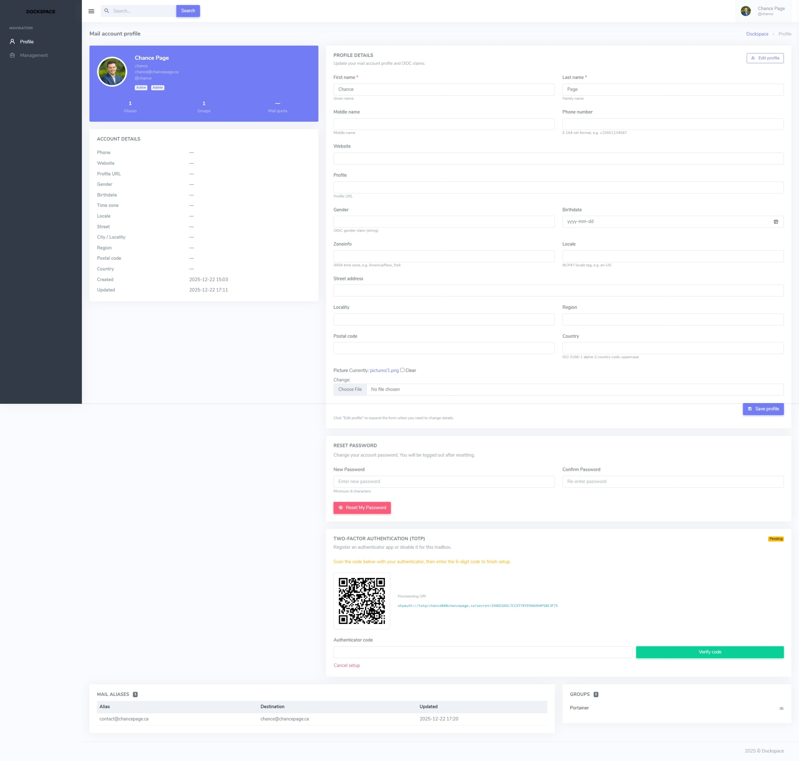

# Dockspace

Dockspace is a self-hosted Docker Mailserver companion with built-in OIDC. It gives small teams one place to create users, issue mailbox credentials, and sign those same people into internal apps—without paying for Google Workspace or Microsoft 365. The UI manages mail users, aliases, quotas, groups, and OIDC clients, then rewrites Docker Mailserver config files so they always match the database.

## Why Dockspace
- One identity for mail and app login.
- Admin-friendly web UI instead of hand-editing Postfix/Dovecot files.
- Built-in OIDC provider with optional per-client TOTP enforcement.
- Ships ready-to-run in Docker; persists DB and media under `/data`.

## Features at a glance
- Mail + identity hub: Single account powers mailbox auth and OIDC SSO.
- DMS-native exports: Generates `postfix-accounts.cf`, `postfix-virtual.cf`, and `dovecot-quotas.cf` exactly as Docker Mailserver expects.
- Role-aware UI: Registration appears only when no accounts exist; session timeout comes from `AppSettings`.
- Groups and access control: Gate OIDC clients by mail groups; require TOTP where needed.

## Docker Mailserver integration
- Django is the source of truth: exports overwrite whatever lives in the Docker Mailserver config directory each time you regenerate.
- Stored credentials use `{SHA512-CRYPT}` and mirror DMS layouts:
  - `postfix-accounts.cf`: Mailbox addresses and password hashes.
  - `postfix-virtual.cf`: Alias -> mailbox routing.
  - `dovecot-quotas.cf`: Per-user quota lines like `user@example.com:10G`.
- Point `DJANGO_DMS_OUTPUT_DIR` (defaults to `data/dms`) at the same directory mounted by Docker Mailserver to keep configs locked together.
- Helper commands:
  - `python manage.py export_dms_files [--output-dir PATH]` — regenerate all three files.
  - `python manage.py scan_dms_files [--dry-run]` — detect and optionally repair drift.
  - `python manage.py set_mail_password EMAIL --password 'secret'` — hash a password and rewrite the DMS files.
- `dms-info.md` documents the exact formats Dockspace writes.

## Run with Docker
```bash
docker compose up -d
```

Key environment settings (see `docker-compose.yml`):
- `DJANGO_DB_PATH`: SQLite location (default `/data/db.sqlite3`).
- `DJANGO_MEDIA_ROOT`: Uploads location (default `/data/media`).
- `DJANGO_DMS_OUTPUT_DIR`: Where the DMS config files are written (mount this to your mail server config, e.g., `/srv/Docker-Mail/config`).
- `DJANGO_CSRF_TRUSTED_ORIGINS`: Your public domain, e.g., `https://mail.example.com`.

Container entrypoint: run migrations, collect static assets, and launch Gunicorn on port `8000`. Persist `/data` for DB/media and mount your Docker Mailserver config path at `/dms` so exports overwrite the live files.

## Page gallery
Screenshots live in `docs/images`:
- Login: 
- Password reset: 
- TOTP challenge: 
- Management (admin dashboard): 
- Profile: 
- Profile edit: 
- No access (client/group gate): 

## Contributing
- Issues and PRs welcome—especially around DMS compatibility and OIDC flow improvements.
- If you change DMS file handling, describe the impact so reviewers can verify against a live mailserver.
- Add new page screenshots to `docs/images` and link them in the gallery.
