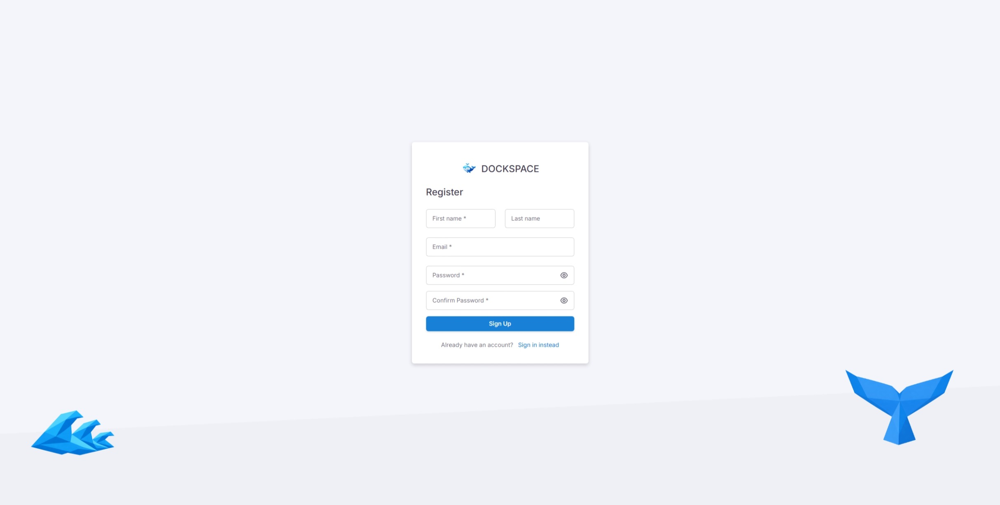
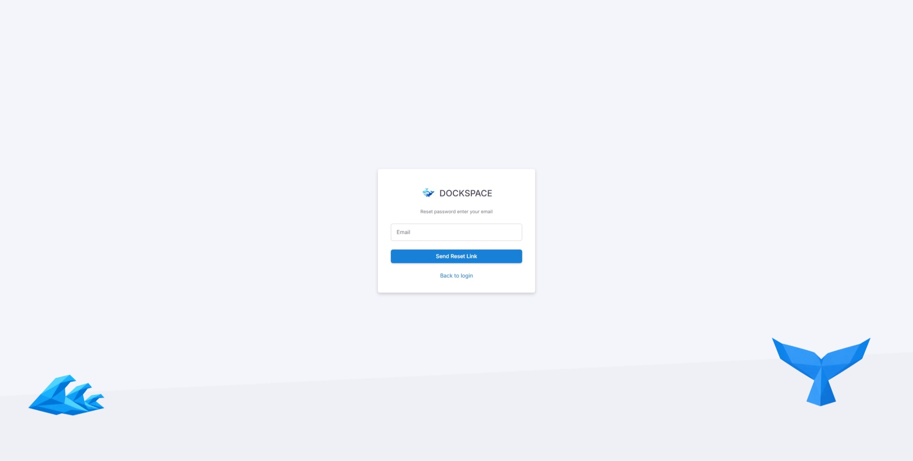
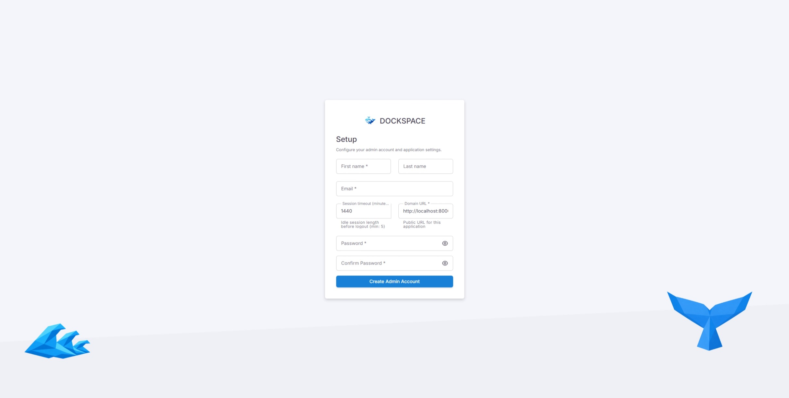
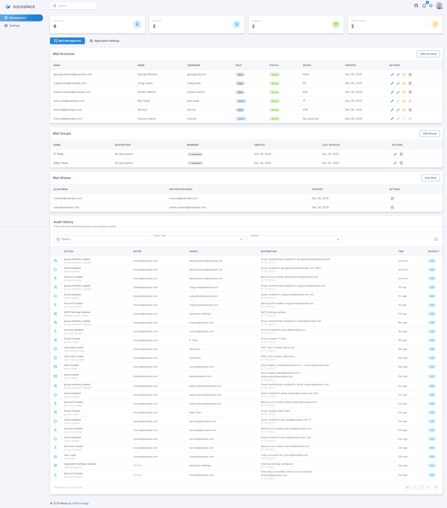
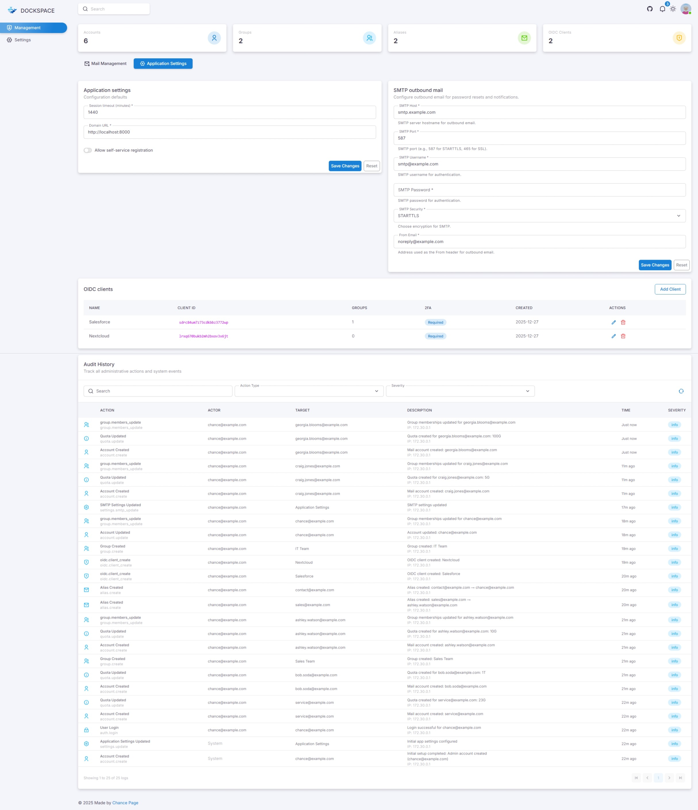
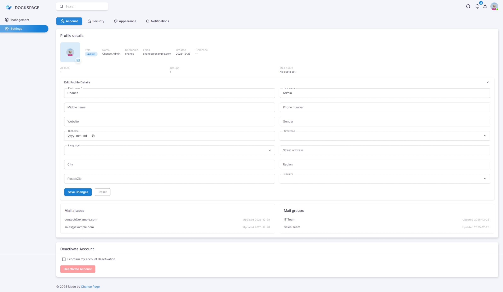
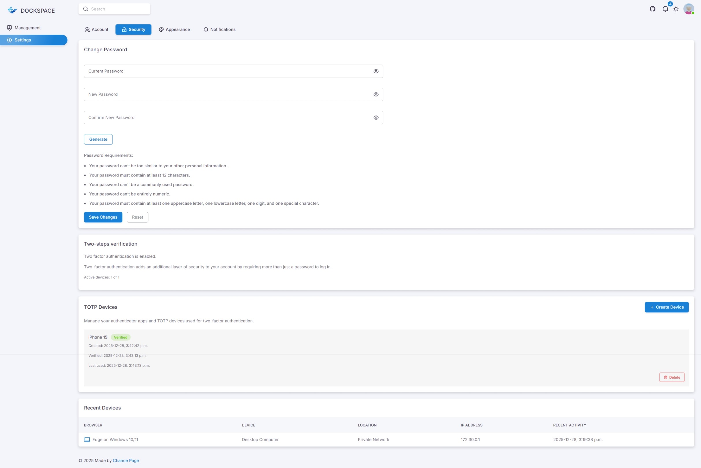
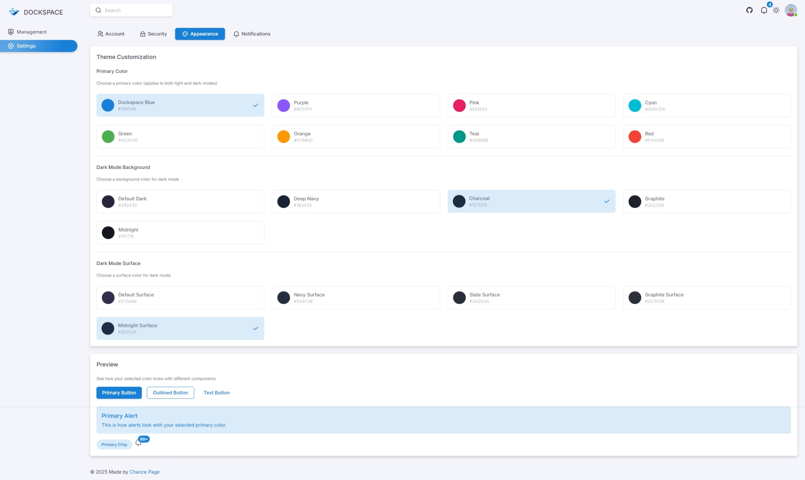

# Dockspace

Dockspace is a self-hosted Docker Mailserver companion with built-in OIDC. It gives small teams one place to create users, issue mailbox credentials, and sign those same people into internal apps—without paying for Google Workspace or Microsoft 365. The UI manages mail users, aliases, quotas, groups, and OIDC clients, then rewrites Docker Mailserver config files so they always match the database.

## Why Dockspace
- One identity for mail and app login.
- Admin-friendly web UI instead of hand-editing Postfix/Dovecot files.
- Built-in OIDC provider with optional per-client TOTP enforcement.
- Ships ready-to-run in Docker; persists DB and media under `/data`.

## Features at a glance
- Mail + identity hub: Single account powers mailbox auth and OIDC SSO.
- DMS-native exports: Generates `postfix-accounts.cf`, `postfix-virtual.cf`, and `dovecot-quotas.cf` exactly as Docker Mailserver expects.
- Role-aware UI: Registration appears only when no accounts exist; session timeout comes from `AppSettings`.
- Groups and access control: Gate OIDC clients by mail groups; require TOTP where needed.

## Docker Mailserver integration
- Django is the source of truth: exports overwrite whatever lives in the Docker Mailserver config directory each time you regenerate.
- Stored credentials use `{SHA512-CRYPT}` and mirror DMS layouts:
  - `postfix-accounts.cf`: Mailbox addresses and password hashes.
  - `postfix-virtual.cf`: Alias -> mailbox routing.
  - `dovecot-quotas.cf`: Per-user quota lines like `user@example.com:10G`.
- Point `DJANGO_DMS_OUTPUT_DIR` (defaults to `data/dms`) at the same directory mounted by Docker Mailserver to keep configs locked together.
- Helper commands:
  - `python manage.py export_dms_files [--output-dir PATH]` — regenerate all three files.
  - `python manage.py scan_dms_files [--dry-run]` — detect and optionally repair drift.
  - `python manage.py set_mail_password EMAIL --password 'secret'` — hash a password and rewrite the DMS files.
- `dms-info.md` documents the exact formats Dockspace writes.

## Quick Start

### 1. Prerequisites
- Docker and Docker Compose
- Docker Mailserver instance (optional, for mail integration)
- Domain name pointing to your server

### 2. Configuration

Create a `.env` file based on `.env.example`:

```bash
cp .env.example .env
```

Edit `.env` with your settings:

```bash
# Environment mode: "production" or "development"
ENVIRONMENT=production

# Your domain(s) - comma-separated for multiple domains
DOMAINS=mail.example.com,example.com

# Optional: Enable Django admin interface (disabled by default)
# ENABLE_DJANGO_ADMIN=true
```

### 3. Docker Compose Setup

Update `docker-compose.yml` volumes to point to your Docker Mailserver config:

```yaml
volumes:
  - ./data:/data                    # Database and uploads
  - /path/to/dms/config:/dms        # Docker Mailserver config directory
```

### 4. Launch

```bash
docker compose up -d
```

Access the web UI at `http://your-domain:8000` (or configure a reverse proxy for HTTPS).

## Environment Variables

### Required (Production)

| Variable | Description | Example |
|----------|-------------|---------|
| `ENVIRONMENT` | Runtime environment | `production` or `development` |
| `DOMAINS` | Allowed hostnames (comma-separated) | `mail.example.com,example.com` |

### Optional

| Variable | Default | Description |
|----------|---------|-------------|
| `DJANGO_SECRET_KEY` | Auto-generated | Django secret key (auto-persisted to `/data/config/secret_key.txt`) |
| `DJANGO_DATA_DIR` | `/data` (prod) or `./data` (dev) | Base directory for database, media, and config |
| `DEBUG` | `false` (prod) or `true` (dev) | Enable Django debug mode |
| `ENABLE_DJANGO_ADMIN` | `false` | Enable Django admin interface at `/admin/` |

### Automatic Behaviors

**Production mode** (`ENVIRONMENT=production`):
- HTTPS enforcement
- Secure cookies
- HSTS headers
- Content Security Policy
- Auto-generates `CSRF_TRUSTED_ORIGINS` from `DOMAINS` with `https://` prefix

**Development mode** (`ENVIRONMENT=development`):
- Allows HTTP
- Auto-configures `localhost`, `127.0.0.1`, `[::1]`
- Relaxed security headers
- Debug toolbar available

### Data Persistence

The container stores all persistent data under `/data`:

```
/data/
├── database/
│   └── db.sqlite3           # SQLite database
├── media/                   # User uploads
├── config/
│   └── secret_key.txt       # Auto-generated Django secret
└── dms/                     # Docker Mailserver exports (default)
    ├── postfix-accounts.cf
    ├── postfix-virtual.cf
    └── dovecot-quotas.cf
```

Mount `/data` to persist everything, or mount individual subdirectories as needed.

## Initial Setup

On first launch, Dockspace runs through an automated setup wizard:

1. **Create Admin Account**: Register the first admin user
2. **Configure Application**: Set application name, domain, and session timeout
3. **SMTP Settings (Optional)**: Configure email notifications
4. **Ready**: Start managing mail accounts and OIDC clients

After setup, the admin account can:
- Create mail accounts with passwords, quotas, and group assignments
- Define mail aliases (forwarding addresses)
- Create mail groups for organizing users
- Register OIDC clients for SSO integration
- Configure per-client TOTP requirements
- Manage appearance themes and notification preferences

## Management Commands

Run Django management commands inside the container:

```bash
docker exec -it dockspace python manage.py <command>
```

### Docker Mailserver Integration Commands

```bash
# Export all DMS config files (postfix-accounts.cf, postfix-virtual.cf, dovecot-quotas.cf)
docker exec -it dockspace python manage.py export_dms_files

# Scan for drift between database and DMS files
docker exec -it dockspace python manage.py scan_dms_files --dry-run

# Repair drift (import DMS changes to database)
docker exec -it dockspace python manage.py scan_dms_files

# Set/reset a user's mail password
docker exec -it dockspace python manage.py set_mail_password user@example.com --password 'newpassword'
```

### Database Management

```bash
# Create database migrations (after model changes)
docker exec -it dockspace python manage.py makemigrations

# Apply migrations
docker exec -it dockspace python manage.py migrate

# Create Django superuser (for admin interface, if enabled)
docker exec -it dockspace python manage.py createsuperuser
```

## Reverse Proxy Setup

Dockspace runs on port 8000. For production, use a reverse proxy with HTTPS:

### Nginx Example

```nginx
server {
    listen 443 ssl http2;
    server_name mail.example.com;

    ssl_certificate /path/to/cert.pem;
    ssl_certificate_key /path/to/key.pem;

    location / {
        proxy_pass http://localhost:8000;
        proxy_set_header Host $host;
        proxy_set_header X-Real-IP $remote_addr;
        proxy_set_header X-Forwarded-For $proxy_add_x_forwarded_for;
        proxy_set_header X-Forwarded-Proto $scheme;
    }
}
```

### Caddy Example

```caddy
mail.example.com {
    reverse_proxy localhost:8000
}
```

## Page gallery
Screenshots live in `docs/images`:

### Authentication
- Login: 
- Register: 
- Password reset: 

### Initial Setup
- App setup: 

### Management (Admin)
- Mail management: 
- App management: 

### Account Settings
- Account: 
- Security: 
- Notifications: 
- Appearance: 

## Contributing
- Issues and PRs welcome—especially around DMS compatibility and OIDC flow improvements.
- If you change DMS file handling, describe the impact so reviewers can verify against a live mailserver.
- Add new page screenshots to `docs/images` and link them in the gallery.
